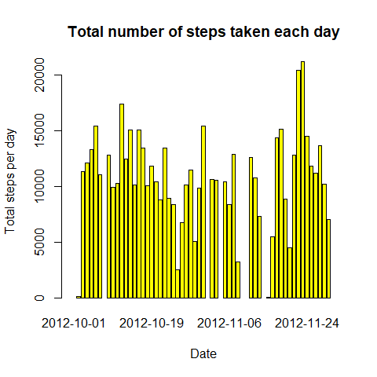

## Loading and preprocessing the data

The data is read into R using `read.csv()` provided that the data file is in the working directory. The `lubridate::` package is used to preprocess the data such that the date variable is transformed into date class instead of the default character class.


```r
library(lubridate)
```

```
## 
## Attaching package: 'lubridate'
```

```
## The following objects are masked from 'package:base':
## 
##     date, intersect, setdiff, union
```

```r
activity <- read.csv("activity.csv")
activity <- transform(activity, date = ymd(date))
str(activity)
```

```
## 'data.frame':	17568 obs. of  3 variables:
##  $ steps   : int  NA NA NA NA NA NA NA NA NA NA ...
##  $ date    : Date, format: "2012-10-01" "2012-10-01" ...
##  $ interval: int  0 5 10 15 20 25 30 35 40 45 ...
```

## What is mean total number of steps taken per day?

Making a histogram of the total number of steps taken each day by using `barplot()`. Using the `barplot()` function might raise some doubts but it answers the question which is to plot a histogram of total number of steps taken per day.


```r
totalspd <- tapply(activity$steps, activity$date, sum)
barplot(totalspd, col = "yellow", xlab = "Date", ylab = "Total steps per day")
title("Total number of steps taken each day")
```

<!-- -->

Mean and median total number of steps taken per day are calculated :


```r
mean(totalspd, na.rm = TRUE)
```

```
## [1] 10766.19
```

```r
median(totalspd, na.rm = TRUE)
```

```
## [1] 10765
```

## What is the average daily activity pattern?

The time series plot of the 5-minute interval and the average number of steps taken, averaged across all days is plotted using `ggplot2::`.
`dplyr::` package is used to group the data accordingly for the plot. The dplyr pipeline is used to group and summarize in order to get the average number of steps taken averaged across all days.


```r
library(dplyr)
```

```
## 
## Attaching package: 'dplyr'
```

```
## The following objects are masked from 'package:stats':
## 
##     filter, lag
```

```
## The following objects are masked from 'package:base':
## 
##     intersect, setdiff, setequal, union
```

```r
library(ggplot2)
avg <- activity %>% group_by(interval) %>% 
          summarise(avg = mean(steps, na.rm = TRUE))
```

```
## `summarise()` ungrouping output (override with `.groups` argument)
```

```r
plot1 <- ggplot(avg) + 
          geom_line(aes(interval,avg), color = "blue", size = 1, alpha = 0.5) +
          ggtitle("Average daily activity pattern") + xlab("Interval") + 
          ylab("Average number of steps")
print(plot1)
```

<!-- -->

There is a peak around 8:00 which suggests that the subject might be either commuting to his work or working out at the gym at that particular time. There is a average steps ranging around 75 the rest of the day meaning that the subject might be occupied with his job allowing for less movement.

The 5-minute interval which has the maximum number of steps averaged across all the days is found by using `grep()`.


```r
avg[grep(max(avg$avg), avg$avg),]
```

```
## # A tibble: 1 x 2
##   interval   avg
##      <int> <dbl>
## 1      835  206.
```

The maximum average number of steps is made at the 8:35 interval. (Most likely his commuting time to his job or his workout time)

## Imputing missing values

The missing values coded as NA can be seen only under the steps variable. The total number of missing values can be calculated by using the `sum()` function in conjunction with `is.na()` function.


```r
sum(as.numeric(is.na(activity$steps)))
```

```
## [1] 2304
```

An object is created which contains all dates having missing values. (It can be easily deduced that the values are missing for particular dates). So, only the missing values in those dates needs imputing.  
The object is matched such that only those dates which has missing values will be imputed with the average number of steps averaged across all days.
All the dates with missing values are looped and the average values are merged with the dataset.
A duplicate dataset is used because each merge loop will delete the previous merge made.
The new dataset with imputed values is created after some processing using dplyr.


```r
library(lubridate)
na <- totalspd[is.na(totalspd)]
naa <- names(na)
naa <- ymd(naa)
avg2 <- avg
names(avg2)[2] <- "steps"

i = 1
while (i <= length(naa)) {
  k = 1
  avg2$date <- naa[i]
  act <- merge(activity, avg2, by = c("date","interval"), all.x = TRUE)
  if (i==1) {
    act2 <- act
    act2$steps <- na
  }
  for (j in act$steps.x) {
    if (is.na(act2$steps[k]) == FALSE) {
      k <- k+1
      next
    }
    if (is.na(j) == TRUE) {
      act2$steps[k] <- act$steps.y[k]
    }
    else if (is.na(j) == FALSE){
      act2$steps[k] <- act$steps.x[k]
    }
    k <- k+1
  }
  i = i+1
}

newactivity <- select(act2, steps, date, interval)
```

The histogram is plotted for the new dataset using the same function.


```r
totalspd2 <- tapply(newactivity$steps, newactivity$date, sum)
barplot(totalspd2, col = "orange", xlab = "Date", ylab = "Total steps per day")
title("Total number of steps taken each day \n after imputing missing values")
```

<!-- -->

The mean and median for the new dataset are calculated :


```r
mean(totalspd2)
```

```
## [1] 10766.19
```

```r
median(totalspd2)
```

```
## [1] 10766.19
```

It can be seen that after imputing the missing values, the total number of steps for that particular dates with missing values ranges around 10,000 steps.  
There is not much change in the mean and median because the average values are imputed in place of the missing values.

## Are there differences in activity patterns between weekdays and weekends?

A new variable called factor is created which sorts the days into weekdays and weekends.


```r
l <- 1
while (l <= length(newactivity$date)) {
  if (weekdays(newactivity$date[l]) == "Sunday") {
    newactivity$factor[l] <- "weekend"
  }
  else {
    newactivity$factor[l] <- "weekday"
  }
  l <- l+1
}

newactivity <- transform(newactivity, factor = factor(factor))
```

A panel plot is plotted using `ggplot::` after organizing the dataset accordingly using the dplyr pipeline.


```r
library(dplyr)
library(ggplot2)
newavg <- newactivity %>% group_by(interval, factor) %>% 
            summarise(avg = mean(steps, na.rm = TRUE))
```

```
## `summarise()` regrouping output by 'interval' (override with `.groups` argument)
```

```r
plot2 <- ggplot(newavg) + 
          geom_line(aes(interval,avg, color = factor), size = 1, alpha = 0.5) + 
          facet_grid(factor ~ .) +
          ggtitle("Activity patterns between weekdays and weekends") + 
          xlab("Interval") + ylab("Average number of steps")
print(plot2)
```

<!-- -->

During the weekdays, we can see that there is peak activity around 8:00. After which, the activity ranges around 50 steps for the rest of the day. We can conclude that there are minimum number of steps made throughout the day suggesting that the subject might be at his job (desk job) allowing him to cause less movement and therefore less number of steps.  
During the weekends, the activity pattern fluctuates throughout the day suggesting that the subject makes movement all day indulging himself with his weekend activities.
